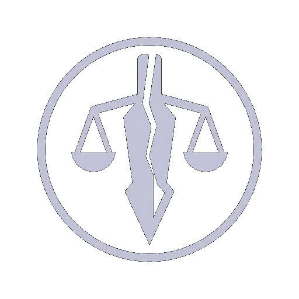

# Radiant: Battle Arena

**A Stormlight Archive fan game built in Unreal Engine 5.8**

Fly on stolen gravity. Burn Stormlight to stay alive. Fight as a Knight Radiant.

[**Learn More →**](https://jaxonhyer.github.io/Radiant-Battle-Arena/) · [Download](https://jaxonhyer.github.io/Radiant-Battle-Arena/Download/) · [Which Order are you?](https://jaxonhyer.github.io/Radiant-Battle-Arena/Quiz/)

*Unofficial · non-commercial · made by one person*

---

## What is this?

Radiant: Battle Arena is a fan-made arena combat game set on **Roshar**, the world of Brandon Sanderson's *The Stormlight Archive*. You play as a Knight Radiant — a warrior bonded to a living spren, able to bend fundamental forces by burning Stormlight.

The hook is that **your power is a countdown**. Stormlight doesn't sit in a tank waiting for you. It leaks out of you constantly, glowing off your skin, whether you spend it or not. Every second airborne is a second closer to falling. You fight, then you scramble for spheres, then you fight again.

> *"A person can only hold Stormlight for a few minutes at most."*
> — [The Coppermind](https://coppermind.net/wiki/Stormlight)

## Playable Orders

Two Orders at launch — the two that share the Surge of **Gravitation**, which is why both of them fly.

| | Order | Surges | Spren | Philosophy |
| :---: | --- | --- | --- | --- |
|  | **Windrunner** | Adhesion · Gravitation | Honorspren | *I will protect.* |
|  | **Skybreaker** | Gravitation · Division | Highspren | *An oath to seek and administer justice.* |

They fly the same way. They fight nothing alike — Adhesion binds things together, Division tears them apart.

More Orders may follow. This is a solo project, so two is what gets finished first.

## Core mechanics

**Stormlight** — the blue bar, top left. Drains continuously. Refilled from spheres and highstorms. It is the resource behind everything you do.

**Lashing** — change which way gravity pulls you and throw yourself at the sky.

| Action | Keyboard | Controller |
| --- | --- | --- |
| Begin hovering | Double-tap `Space` | Double-tap `A` / `X` |
| Start Lashing | `Shift` | Left stick click |
| Increase intensity | `W` | Left stick forward |
| Decrease intensity | `S` | Left stick back |
| Steer | Mouse | Right stick |
| Dodge left / right | `A` / `D` | Left stick left / right |

**Adhesion** (Windrunner) and **Division** (Skybreaker) are in development.

## Status

Early development. No public build yet — Windows, macOS and Linux are all planned, and the [roadmap](https://jaxonhyer.github.io/Radiant-Battle-Arena/Roadmap/) tracks what's done and what's next. The [devlog](https://jaxonhyer.github.io/Radiant-Battle-Arena/Devlog/) has the commit-by-commit history.

## What's in this repo

This branch (`gh-pages`) holds the **Learn More website** — a static HTML/CSS/JS site with a lore primer for people who haven't read the books, pages for both Orders, an Order quiz, downloads and free assets. No framework, no build step.

Working on the site? See **[CONFIG.md](CONFIG.md)** for every setting and content file.

Some game assets also live here under `assets/`, and free downloads are listed on the [assets page](https://jaxonhyer.github.io/Radiant-Battle-Arena/Assets/).

## New to the Stormlight Archive?

Start with the [in-site primer](https://jaxonhyer.github.io/Radiant-Battle-Arena/StormlightArchiveLore/) — Roshar, Stormlight, spren and the Knights Radiant, written for people who have never opened the books. Spoilers are limited to *Words of Radiance* and anything later is blurred until you ask for it.

If you'd rather read the real thing, start with **The Way of Kings**.

## Legal

Radiant: Battle Arena is an **unofficial, non-commercial fan project**. The Stormlight Archive, Roshar, the Knights Radiant and all related names and concepts are the property of **Brandon Sanderson and Dragonsteel Entertainment**. This project is not affiliated with, endorsed by, or sponsored by Dragonsteel.

It is free, and it will stay free.

Original site content is licensed **CC BY-SA 4.0**. Quoted material remains under the terms of its own source and is excluded from that grant. Order glyphs in this repo are original designs, not reproductions of Dragonsteel artwork.

**Rights holders:** if anything here should be changed or removed, please [open an issue](https://github.com/JaxonHyer/Radiant-Battle-Arena/issues) or use the contact on the [credits page](https://jaxonhyer.github.io/Radiant-Battle-Arena/Credits/). It will be handled promptly.

Built with Unreal Engine 5.8.
